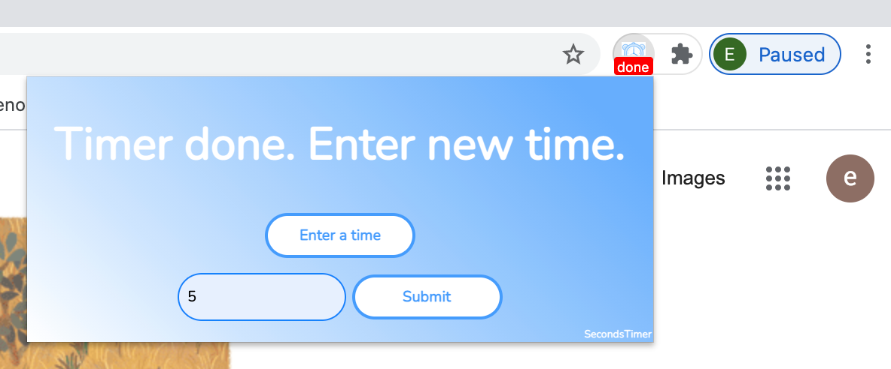

# **Seconds Timer ⏱️**  

  
**A simple and precise countdown timer for your browser!**  

## ✨ **Overview**  
**Seconds Timer** is a **Chrome extension** that lets you quickly set up a countdown timer with just a few clicks. I made this for when I was looking at recipes and needed a timer on the side. It is generally great for **productivity, workouts, studying, cooking, and more**, it helps you stay on track without the need for additional apps.  

🔗 **Get it on Chrome Web Store:** [Seconds Timer](https://chromewebstore.google.com/detail/secondstimer/kehfggmidepjjoeefonlodjldheenihe)  

---

## 🚀 **Features**  
✅ **Quick & Simple** – Set a timer in seconds with an intuitive interface.  
✅ **Custom Alerts** – Get notified with a sound and desktop notification.  
✅ **Lightweight & Fast** – No unnecessary bloat, just a timer that works.  
✅ **Persistent Timers** – Keeps running even if you switch tabs.  
✅ **Dark Mode** – Easy on the eyes for night-time use.  

---

## 🖥️ **Usage Example**  
1. Open the extension by clicking the **timer icon**.  
2. Enter a time (e.g., **30s**, **5m**, **1h**).  
3. Press **Start** and let it run in the background.  
4. Receive a notification when time's up! 🎉  

## Preview

